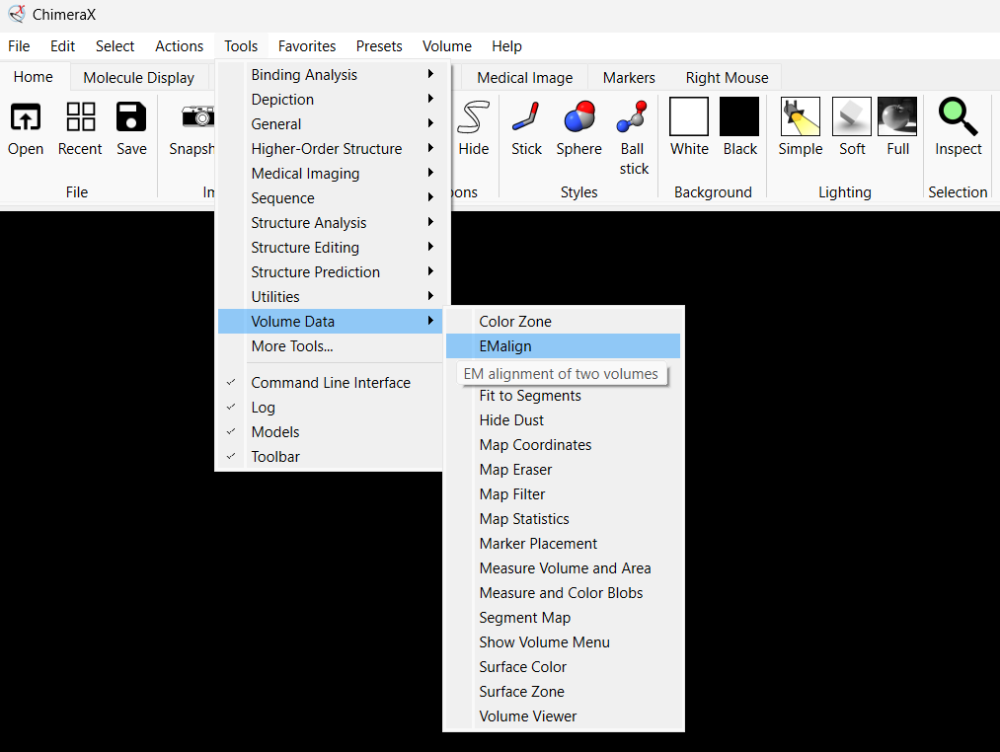

# EMalign - ChimeraX Bundle

EMalign is an algorithm for aligning rotation, reflection, and translation between volumes.  

This bundle allows the user to install it directly within the ChimeraX program.

<h2>Install EMalign</h2>
<h3>Install EMalign from source code:</h3>

* Download the emalign folder and save it in the designated directory (PATH=emalign location).
* Open ChimeraX and run the following commands in the command line bar at the bottom of the screen:
   
```
   devel build PATH\emalign
   devel install PATH\emalign
   devel clean PATH\emalign
```

* Restart ChimeraX, then the EMalign tool should appear in the toolbar:


   
